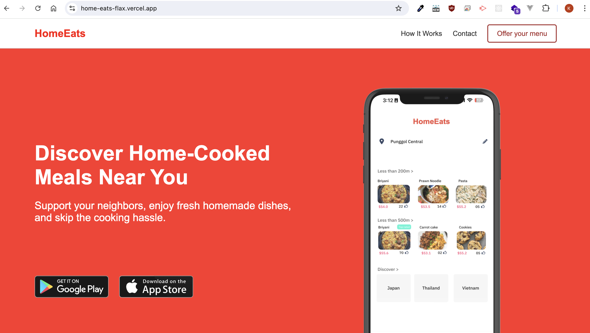

# HomeEats
Simple mobile responsive landing page using HTML and CSS and deployed using vercel

## Overview
Here's an overview of the components we'll need:

- Frontend: HTML, CSS
- Backend: No backend required
- Deployment: Vercel 

## Setup
Git clone current repo on your local
```bash
git clone https://github.com/KevinJudith/HomeEats.git
```
Move to HomeEats repository
```bash 
cd HomeEats
```

Launch a local server using python
```bash
python3 -m http.server 8000
```
You should see something like this
```bash
* python3 -m http.server 8000
* Serving HTTP on :: port 8000 (http://[::]:8000/) ...
```

## Deployment
Option1: go to vercel.com and signup using your github account. Then choose the repo you want to deploy and vercel will do the rest

Option2: via CLI commands on your terminal

## Deploy using vercel CLI

Login to your vercel account and follow the instructions
```bash
vercel login
```
Deploy to production
```bash
vercel --prod
```


